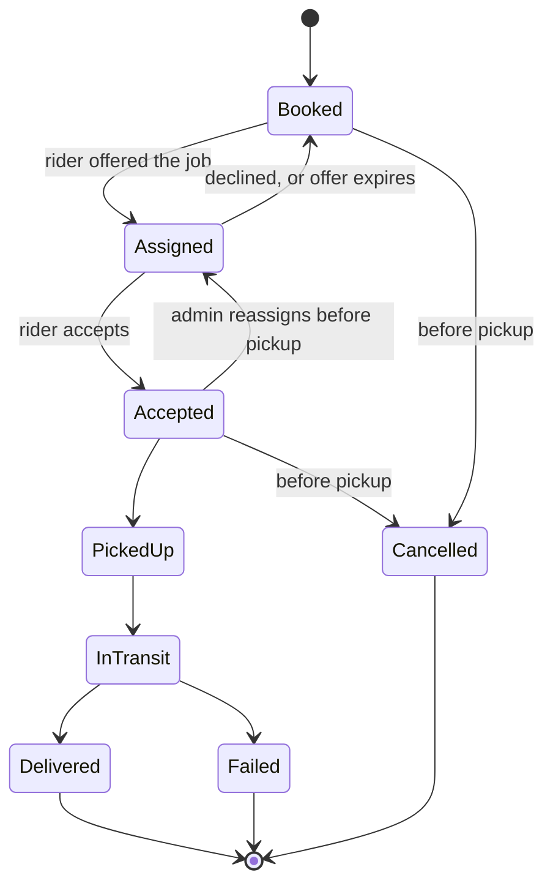

# Real-Time Parcel Delivery Management System (PDMS)

A full-stack, real-time parcel delivery platform built for Dhaka, with three
roles — **customer**, **delivery agent (rider)**, and **admin** — and live
GPS tracking as the flagship feature. A customer books a parcel, the system
prices it, assigns the nearest available rider, and everyone involved
(customer, rider, admin) watches the delivery move on a live map from pickup
to drop-off, in real time, over Socket.io.

Built as a seven-day sprint for a university Software Engineering course,
then iterated milestone by milestone into something closer to a real,
demoable product: authentication and role-based access, dynamic pricing,
an offer/accept/decline rider workflow, proof-of-delivery capture, Stripe
test-mode payments and COD reconciliation, in-app messaging, analytics, and
a from-scratch design system, all running on a free-tier deploy (Vercel +
Render + MongoDB Atlas).

---

## Live demo

| | |
|---|---|
| **App (Vercel)** | [real-time-pdms-client.vercel.app](https://real-time-pdms-client.vercel.app) |
| **API (Render)** | [real-time-pdms.onrender.com](https://real-time-pdms.onrender.com) |

Both run on free tiers. Render's free instance spins down after inactivity,
so the **first** request after a while can take 30–60 seconds to wake it up
— `GET /health` on the API exists specifically for this, to warm the server
before a live demo. The client's login screen ships with a visible
seeded-credentials panel (`VITE_SHOW_DEMO_LOGINS`), so no account setup is
needed to try any of the three roles.

---

## Table of contents

- [Live demo](#live-demo)
- [Course & team](#course--team)
- [Key features](#key-features)
- [Tech stack](#tech-stack)
- [Repository layout](#repository-layout)
- [Domain model](#domain-model)
- [Real-time layer](#real-time-layer)
- [Security](#security)
- [Getting started](#getting-started)
- [Environment variables](#environment-variables)
- [Available scripts](#available-scripts)
- [Deployment](#deployment)
- [Design system](#design-system)
- [Project status](#project-status)
- [License](#license)

---

## Course & team

This is a group project for **CSC 470 (Software Engineering)** at
**International University of Business Agriculture & Technology (IUBAT)**,
under **Faculty: [Momtazul Arefin Labib](https://www.linkedin.com/in/arefin-labib/)**, CUET.

| Name | Role | Student ID |
|---|---|---|
| [Md. Monsur Rahman (Riaz)](https://www.linkedin.com/in/monsurriaz/) | Project Lead | 23103157 |
| Sadi Md. Imtiaj | Member | 23103155 |
| Md. Fardin | Member | 23103120 |

---

## Key features

- **Three-role auth** — customer, agent, admin, JWT in httpOnly cookies,
  role scoping enforced in query middleware (not per-route by convention).
- **Booking + dynamic pricing** — real address geocoding (Nominatim), real
  driving distance (OpenRouteService), a formula-driven pricing engine
  (`zoneBase + distance × rate + weight-tier surcharge`) admins can edit
  live from a dashboard, with prices snapshotted onto each parcel at
  booking time.
- **Nearest-rider assignment** — `$near` geospatial query over a
  `2dsphere` index, zone fallback, admin override, all bound by the same
  approval/availability checks.
- **Offer / accept / decline lifecycle** — a rider is *offered* a delivery,
  not handed it; they must explicitly accept before it counts as theirs.
  Declines and unanswered offers (evaluated lazily on read, since Render's
  free tier sleeps and can't be trusted to run a cron job) exclude that
  rider from being re-offered the same delivery, and return it to the pool.
- **Live GPS tracking** — Socket.io rooms per parcel, an animated MapLibre
  map for the customer, a live fleet board for the admin, a rider-side
  publisher throttled to protect the free-tier database, and a
  `simulate.ts` script that fakes a rider's GPS along a real Dhaka route
  for demos.
- **Proof of delivery** — a photo (via Cloudinary, unsigned upload preset)
  or an OTP/signature captured on delivery, gating the terminal
  `Delivered` state.
- **Payments** — Stripe test-mode checkout behind a provider interface, or
  cash-on-delivery with a per-agent reconciliation table for admins.
- **In-app messaging** — a customer and their currently-assigned rider can
  message each other from pickup through delivery, over the same
  authenticated socket room tracking already uses.
- **Admin analytics** — stat cards, a zone-performance chart, delayed-
  delivery alerts, revenue, all computed under the same role-scoping rules
  as everything else.
- **A from-scratch, frozen design system** ("Meridian") — no UI framework's
  default look; every color, radius, spacing and type-scale value comes
  from design tokens generated off a static HTML reference.

---

## Tech stack

| Layer | Choice |
|---|---|
| Frontend | React 18 + Vite + TypeScript, React Router |
| Styling | Tailwind CSS, driven entirely by CSS custom properties (`tokens.css`) |
| Server state | TanStack Query |
| Client state | React's own built-ins (`useState`; `useSyncExternalStore` for the one cross-component case) |
| Backend | Node.js + Express + TypeScript |
| Real-time | Socket.io (one room per parcel) |
| Database | MongoDB Atlas + Mongoose, with `2dsphere` geospatial indexes |
| Validation | Zod schemas in `/shared`, imported by both client and server |
| Auth | JWT in httpOnly cookies, role claim embedded in the token |
| Map rendering | MapLibre GL JS |
| Map tiles | [OpenFreeMap](https://openfreemap.org/) (`positron` style) — no API key, no quota |
| Geocoding | Nominatim (OpenStreetMap), rate-limited to 1 req/sec, results cached in Mongo |
| Distance / routing | OpenRouteService (free-tier API key) |
| Media | Cloudinary, unsigned upload preset (browser uploads directly, no server secret) |
| Payments | Stripe, test mode only, behind a `PaymentProvider` interface |
| Deployment | Vercel (client) + Render (server) + MongoDB Atlas (database) |

The entire stack runs on free tiers by design — that constraint shaped
several architectural decisions (offer expiry evaluated on read instead of
by a cron job, GPS positions persisted at most once every 30 seconds, no
paid geocoding/routing provider, etc.).

---

## Repository layout

```
/client          Vite + React app
  /src
    /components  shared UI primitives (Button, Badge, LifecycleRail, StatCard, Field, ...)
    /features    booking/ tracking/ agent/ admin/ auth/ customer/ payments/
                 messaging/ pricing/ deliveries/ analytics/ profile/ public/ shell/
    /lib         API client, Socket.io client, MapLibre setup
    /styles      tokens.css — the design system tokens
/server
  /src
    /models      Mongoose schemas (User, Agent, Parcel, Delivery, Payment, Zone, ...)
    /routes      Express routers, one per resource
    /services    business logic — pricing, assignment, lifecycle, analytics, POD
    /sockets     Socket.io connection handling and broadcast
    /middleware  auth, role scoping, rate limiting, error handling
    /lib         geocoding, routing, payments (Stripe), Cloudinary, env validation
/shared
  /schemas       Zod schemas + inferred TypeScript types, imported by both sides
/scripts
  seed.ts          zones, pricing config, demo users, demo riders, demo parcels
  seed-parcels.ts  additional demo parcel data
  simulate.ts      fakes a rider's GPS along a real Dhaka route, for live-tracking demos
/docs
  design-system-v3-meridian.html      the frozen visual reference for most of the app
  design-system-v3.1-addendum.html    corrections to v3 (read alongside it, wins on conflict)
  design-v4-landing-login.html        supersedes v3 for the public landing page and /login only
  design-system.html                  v1, superseded, kept for history
CLAUDE.md          the project's own build rules — read this first
DEFERRED.md        consciously parked work, by milestone, with reasons
.env.example       every environment variable the project uses, with empty values
```

This is an **npm workspaces** monorepo (`shared`, `server`, `client`), so a
single `npm install` at the repository root sets up all three.

---

## Domain model

**Entities:** `User`, `Agent`, `Parcel`, `Delivery`, `Payment`, `Zone`.

### Delivery lifecycle

The delivery status machine is enforced **server-side only** — the client
never decides what transition is legal; every change goes through one
`advanceStatus()` function backed by a single transition map.



Key rules:
- **`Assigned` means offered, not held.** A rider hasn't committed to a
  delivery until they explicitly `Accept` it.
- **Decline is permanent, per delivery.** A rider who declines (or lets an
  offer expire) is excluded from ever being re-offered *that specific*
  delivery again — not from the roster generally.
- **Offer expiry is evaluated on read, not on a schedule.** Render's free
  tier sleeps after inactivity, so a `setInterval`/cron job can't be
  trusted to fire. Every read path that loads a delivery checks the
  current offer's deadline first, and lets it lapse back to `Booked`
  idempotently if it's overdue.
- **`Delivered` requires proof of delivery already on the record** — a
  photo, an OTP, or a signature.

### Pricing

```
price = zoneBase + (distanceKm × perKmRate) + weightTierSurcharge
```

All three inputs live in one admin-editable `PricingConfig` document —
never hard-coded. A price is **snapshotted onto the parcel at booking
time**, so a later config change never retroactively changes an existing
parcel's price. The cash-on-delivery amount is always derived from that
snapshot server-side; a customer cannot declare it.

### Assignment

Nearest available agent to the pickup point, via a `$near` query on a
`2dsphere` index over the agent's current location, filtered to available,
approved agents in a matching zone — falling back to zone-only matching if
nobody is within 5&nbsp;km. An admin can override this, but the override is
still bound by the same approval checks.

---

## Real-time layer

- One Socket.io room per parcel: `parcel:{id}`. The customer and any admin
  subscribe; the assigned rider publishes.
- A rider's device emits a location update **at most every 3 seconds**;
  excess ticks are dropped, not queued.
- The server broadcasts every accepted tick to the room immediately, but
  only **persists** a position to MongoDB at most once every 30 seconds —
  the free-tier database would not survive a write per GPS tick.
- If the socket connection drops, the client falls back to REST polling
  every 10 seconds.
- Socket connections are authenticated on handshake (reusing the same JWT
  cookie as the REST API) and joining a room is authorized against the
  same role-scoping rules as the equivalent REST read — there is no
  separate socket permission model to drift out of sync.

---

## Security

- Customers see only their own parcels; agents see only their own
  assignments; admins see everything — enforced in query middleware, not
  by convention in individual route handlers.
- `User.status` is checked on **every** authenticated request and on the
  socket handshake, not just at login — a JWT is a bearer token, so a
  suspended account has to be blocked on each use of it, not once at
  sign-in.
- The recipient's phone number is exposed only to the currently-assigned
  rider, and only while the delivery is non-terminal — never to any other
  rider, never to the customer who typed it in, never in the public
  tracking payload.
- Public tracking by tracking ID (no login required) deliberately returns
  a smaller payload than the authenticated view: no names, no phone
  numbers, no street-level address, no price, no COD amount.
- Passwords are hashed (bcrypt); nothing sensitive (`passwordHash`,
  payment secrets, another user's phone number) is ever serialized to a
  client, in any role.
- Basic security headers (Helmet), rate limiting on `/auth/login`,
  `/auth/register`, and the public tracking-by-ID endpoint, and a
  production/development split in the global error handler (generic
  messages in production; specific, typed errors like "account
  suspended" or "weight limit exceeded" always pass through as-is).

---

## Getting started

To run your own local copy — for the hosted version, see
[Live demo](#live-demo) above.

### Prerequisites

- Node.js ≥ 20
- A MongoDB Atlas cluster (or any MongoDB instance with `2dsphere` index
  support)
- Free API keys/accounts for: OpenRouteService, Cloudinary (unsigned
  upload preset), and — optionally, for payments — a Stripe **test mode**
  account

### Setup

```bash
# 1. Install dependencies for all three workspaces
npm install

# 2. Copy the environment template and fill in real values
cp .env.example .env

# 3. Seed the database — zones, pricing config, demo users/riders/parcels
npm run seed

# 4. Run the client and server together
npm run dev
```

The client runs on `http://localhost:5173`, the server on
`http://localhost:5001` (not 5000 — macOS's AirPlay Receiver already binds
that port).

### Demoing live tracking

```bash
npm run simulate
```

This drives a seeded rider's GPS along a real Dhaka route so an active
delivery can be watched moving live on the map, exactly as it would from a
real rider's phone.

---

## Environment variables

One `.env` file at the repository root serves both the client (via Vite's
`VITE_`-prefixed convention) and the server. See `.env.example` for the
authoritative, always-current list. Summary:

**Server** (Render):

| Variable | Purpose |
|---|---|
| `NODE_ENV` | `development` / `production` — gates generic error messages and rate limiting |
| `PORT` | HTTP port (defaults to 5001) |
| `CLIENT_ORIGIN` | Allowed CORS origin for both Express and Socket.io |
| `OFFER_WINDOW_MINUTES` | How long a rider has to accept/decline an offer before it expires |
| `MONGODB_URI` | Atlas connection string |
| `JWT_SECRET` | ≥ 32 chars, signs the auth cookie |
| `JWT_EXPIRES_IN` | Auth cookie/token lifetime |
| `COOKIE_SECURE` | `true` in production, so the cookie is sent only over HTTPS |
| `NOMINATIM_BASE_URL` / `NOMINATIM_USER_AGENT` | Geocoding endpoint + required contact string |
| `ORS_API_KEY` | OpenRouteService distance/routing key |
| `CLOUDINARY_CLOUD_NAME` | Verifies an uploaded photo URL belongs to our cloud |
| `PAYMENT_PROVIDER` | `stripe` or `none` |
| `STRIPE_SECRET_KEY` | Must be a `sk_test_...` key — a live key refuses to boot |
| `STRIPE_WEBHOOK_SECRET` | Verifies the Stripe webhook's signature |

**Client** (Vercel, `VITE_*`):

| Variable | Purpose |
|---|---|
| `VITE_API_BASE_URL` | REST API base URL |
| `VITE_SOCKET_URL` | Socket.io endpoint |
| `VITE_MAP_STYLE_URL` | OpenFreeMap style URL |
| `VITE_CLOUDINARY_CLOUD_NAME` / `VITE_CLOUDINARY_UPLOAD_PRESET` | Direct browser → Cloudinary uploads |
| `VITE_STRIPE_PUBLISHABLE_KEY` | Client-side Stripe checkout |
| `VITE_SHOW_DEMO_LOGINS` | Shows/hides the seeded-credentials panel on the login screen |

---

## Available scripts

Run from the repository root unless noted otherwise.

| Command | Description |
|---|---|
| `npm run dev` | Runs client and server together (`concurrently`) |
| `npm run dev:server` | Server only, with hot reload |
| `npm run dev:client` | Client only |
| `npm run seed` | Seeds zones, pricing config, demo users/riders/parcels |
| `npm run simulate` | Fakes a rider's GPS along a real route, for live-tracking demos |
| `npm test` | Runs the server's test suite (Node's built-in test runner) |
| `npm run typecheck` | Type-checks all three workspaces (`shared`, `server`, `client`) |

---

## Deployment

Live at [real-time-pdms-client.vercel.app](https://real-time-pdms-client.vercel.app) (client) and [real-time-pdms.onrender.com](https://real-time-pdms.onrender.com) (API) — see [Live demo](#live-demo) above.

- **Client → Vercel.** Root directory `client`, build command
  `npm run build`, output directory `dist`. `client/vercel.json` adds the
  standard single-page-app rewrite (`/(.*) → /index.html`) so a direct
  page reload on a client-side route doesn't 404 — Vercel checks the
  filesystem for a matching static file before falling through to that
  rewrite, so real JS/CSS/image assets are unaffected.
- **Server → Render.** Root directory the repository root (npm workspaces
  needs to resolve `@pdms/shared` from a single install), start command
  `npm run start --workspace @pdms/server`, health check path `/health`
  (returns `200` with a live database-connectivity check, used to wake
  Render's free tier before a demo).
- **Database → MongoDB Atlas.**
- CORS (both Express and Socket.io) and the Stripe webhook path
  (`POST /payments/webhook`) all read from environment variables, so a
  domain change after the first deploy needs a config update, not a code
  change.

---

## Design system

The app's visual design ("Meridian") is **frozen** and lives outside the
codebase as static HTML references in `/docs`, not as a Figma file or a
component-library README:

- `design-system-v3-meridian.html` — the primary reference for nearly
  every screen: palette, type scale, components, and the full route table.
- `design-system-v3.1-addendum.html` — a small set of corrections to v3
  (read alongside it; wins on any conflict).
- `design-v4-landing-login.html` — a newer visual treatment that applies
  **only** to the public landing page (`/`) and `/login`; every other
  screen, including `/signup`, stays on v3.

`client/src/styles/tokens.css` is generated from these references. No
color, radius, font, or spacing value is ever chosen by hand outside that
file.

---

## Project status

Built milestone by milestone, from a bare skeleton through live tracking,
payments, an offer/accept/decline rider workflow, messaging, a full visual
redesign, and finally deployment.

| Milestone | Scope |
|---|---|
| M0 – M1 | Design tokens, static shells; auth, models, seed script |
| M2 – M3 | Booking + pricing engine; nearest-rider assignment + lifecycle |
| M4 – M5 | Live GPS tracking + simulator; proof of delivery + payments |
| M6 | Analytics, polish, mobile pass for the rider workspace |
| M6.5 – M6.98 | Full visual system replacement ("Meridian v3") across every screen, plus follow-up UI/regression fixes |
| M8 | Offer/accept/decline delivery lifecycle, with per-delivery decline exclusion and on-read offer expiry |
| M9 – M9.9 | Recipient-phone narrowing, customer↔rider messaging, agent suspension rules, landing/login v4 redesign, profile photos, booking-form/autofill polish |
| M10 | Deploy (Vercel + Render + Atlas) and final rehearsal — in progress |

See `DEFERRED.md` for everything consciously parked out of a milestone,
with the reasoning behind each call, and `CLAUDE.md` for the full set of
build rules this project holds itself to.

---

## License

Academic project for CSC 470 (Software Engineering), IUBAT. No open-source
license is currently declared; all rights reserved to the contributors
listed above unless a license is added later.
